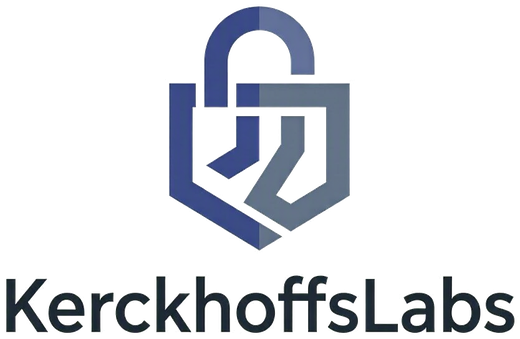

# KerckhoffsLabs.Security.Cryptography.Pkcs11

Modern, secure-by-default **PKCS#11 v3.2** interop for .NET.

This site hosts the generated API reference. Browse the [**API documentation**](api/index.md) for the
full surface: the high-level façade (`Pkcs11Library`, `Pkcs11Workspace`, `Pkcs11Session`), the
algorithm adapters (`RSAPkcs11`, `ECDsaPkcs11`, `AesGcmPkcs11`, `MLKemPkcs11`, `MLDsaPkcs11`,
`SlhDsaPkcs11`, …), the object/attribute model, and the low-level interop types.

## Highlights

- Secure-by-default: weak mechanisms (MD5, SHA-1, DES/3DES/RC2, RSA PKCS#1 v1.5, DSA) are
  `[Obsolete]` and gated behind an explicit `AllowInsecure` opt-in.
- Post-quantum ready: ML-KEM (FIPS 203), ML-DSA (FIPS 204), SLH-DSA (FIPS 205).
- Token-resident keys: non-extractable private keys with on-token operations by default.
